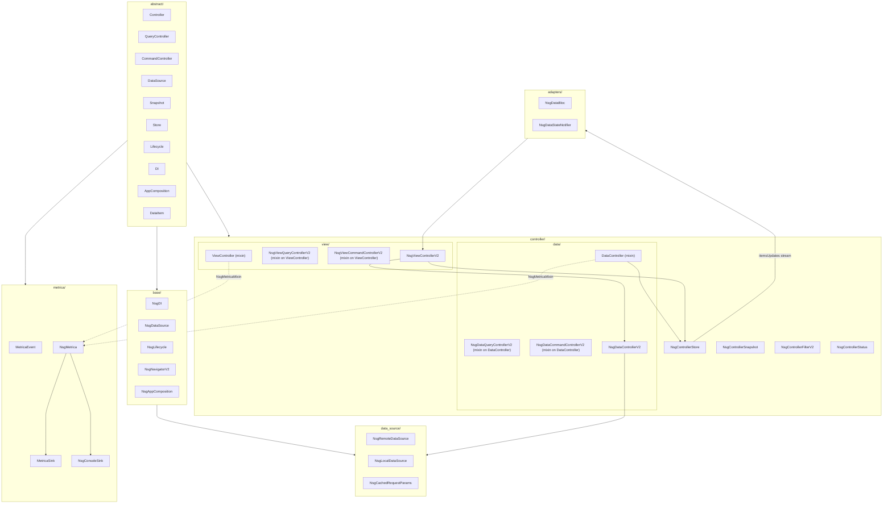
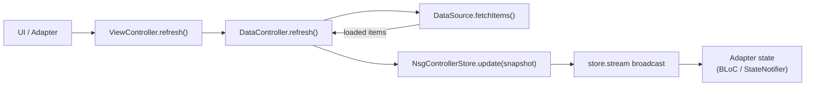
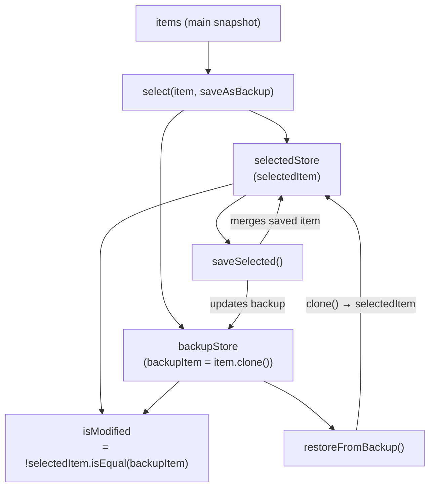

# nsg_data v2 Architecture Model

## Main Architecture Diagram



---

## Snapshot Update Flow

Every state change in a controller ends with `store.update(snapshot.copyWith(...))`, which broadcasts through `store.stream`. Adapters subscribe to this stream.



---

## Selected Item Lifecycle

`ViewController` maintains two extra `NsgControllerStore` instances — `selectedStore` and `backupStore` — for page-scoped form state. These are **not** mirrored into adapters.



---

## Layer Inventory

### `abstract/`

| File | Type | Role |
|---|---|---|
| `controller.dart` | `Controller`, `QueryController`, `CommandController` | Base contracts for all controllers |
| `data_source.dart` | `DataSource` | Fetch/upsert/delete/count contract |
| `snapshot.dart` | `Snapshot` | Immutable state unit with `copyWith` |
| `store.dart` | `Store` | Owner of current snapshot + update gate |
| `lifecycle.dart` | `Lifecycle` | `init()` / `dispose()` |
| `di.dart` | `DI<D>` | Typed dependency binding/lookup |
| `app_composition.dart` | `AppComposition` | Composition root contract (DI + navigator) |
| `app_navigator.dart` | `AppNavigator` | `push` / `pop` / `go` / `clear` |
| `data_item.dart` | `DataItem` | Item contract: `id`, `toJson`, `fromJson`, `copyWith` |
| `metrica.dart` | `MetricaEvent`, `MetricaSink`, `Metrica` | Analytics contracts; `Lifecycle` on sink and service |

### `base/`

| File | Type | Role |
|---|---|---|
| `nsg_di.dart` | `NsgDI` | Concrete DI with optional qualifier; `bind` calls `init()` |
| `nsg_data_source.dart` | `NsgDataSource` | Adds per-call retry hooks to `DataSource` |
| `nsg_lifecycle.dart` | `NsgLifecycle` | Marker interface for `DI`-managed objects |
| `nsg_navigator.dart` | `NsgNavigatorV2` | Wraps global `NsgNavigator`; `clear` goes to `initialRoute` |
| `nsg_app_composition.dart` | `NsgAppComposition` | Narrows `AppComposition` to `NsgDI` + `NsgNavigatorV2` |

### `controller/`

| File | Type | Role |
|---|---|---|
| `nsg_controller_store.dart` | `NsgControllerStore<T>`, `NsgControllerStoreMixin` | Holds `NsgControllerSnapshot`; broadcasts via `StreamController.broadcast` |
| `nsg_controller_snapshot.dart` | `NsgControllerSnapshot<T>` | Immutable snapshot: `items`, `totalCount`, `status`, `error`, `requestParams`, `loadReference`, `validateResults` |
| `nsg_controller_status.dart` | `NsgControllerStatus` | Enum: `idle`, `loading`, `success`, `error` |
| `nsg_controller_filter.dart` | `NsgControllerFilterV2` | Standalone filter snapshot: `searchString` + `NsgTypedPeriod` |
| `data/nsg_data_controller.dart` | `DataController`, `NsgDataQueryControllerV2`, `NsgDataCommandControllerV2`, `NsgDataControllerV2<T>` | Data layer: query (load/refresh/cache/stale-guard), command (create/save/delete/validate); optional `NsgMetricaMixin` hooks |
| `view/nsg_view_controller.dart` | `ViewController`, `NsgViewQueryControllerV2`, `NsgViewCommandControllerV2`, `NsgViewControllerV2<T>` | View layer: selected/backup lifecycle, `observeStatus` widget builder; optional metrica hooks for select/create |
| `nsg_metrica_mixin.dart` | `NsgMetricaMixin` | `metrica`, `metricaControllerKey`, `trackMetrica*` helpers, `trackEvent` |

### `metrica/`

| File | Type | Role |
|---|---|---|
| `nsg_metrica.dart` | `NsgMetrica` | Composite `Metrica`: fan-out `track()` to all sinks (sync dispatch, async per sink) |
| `nsg_metrica_events.dart` | `NsgMetrica*Event` | Built-in event types (controller lifecycle, load/save/delete/error/retry, navigation, user_action, performance) |
| `nsg_console_sink.dart` | `NsgConsoleSink` | Debug sink via `debugPrint`; default `onlyInDebug: true` |

### `data_source/`

| File | Type | Role |
|---|---|---|
| `nsg_remote.dart` | `NsgRemoteDataSource` | HTTP transport via `NsgDataRequest`/`NsgDataPost`/`NsgDataDelete` + retry |
| `nsg_local.dart` | `NsgLocalDataSource` | Local DB via `NsgLocalDb` + retry |
| `nsg_cached_request_params.dart` | `NsgCachedRequestParams` | Normalizes `NsgDataRequestParams` to a stable cache-key string |

### `bloc/`, `riverpod/`

| File | Type | Role |
|---|---|---|
| `bloc/nsg_data_bloc.dart` | `NsgDataBloc<T>` | BLoC wrapper: events → `NsgViewControllerV2` methods; bloc state = main list `NsgControllerSnapshot` |
| `riverpod/nsg_data_provider.dart` | `NsgDataStateNotifier<T>`, `nsgDataProvider` | Riverpod 1.x `StateNotifier` wrapper; `nsgDataProvider` creates an `autoDispose` provider |

---

## Key Runtime Flows

### 1. List load

```
NsgViewControllerV2.refresh()
  → dataController.refresh()
    → store.update(snapshot.copyWith(status: loading))
    → dataSource.fetchItems<T>(params, loadReference, retryIf, onRetry)
        [stale guard: _lastRequestId set before fetch, checked after]
        [throws NsgV2ExceptionDataObsolete if superseded → silently ignored]
    → dataSource.selectCount<T>(params)
    → store.update(snapshot.copyWith(items, totalCount, status: success))
    → store.stream broadcasts new snapshot
      → NsgDataBloc._onSync emits new state
      → NsgDataStateNotifier._subscription sets state
```

### 2. Save selected item

```
NsgViewControllerV2.saveSelected()
  → merge selectedItem into dataController.store (optimistic update)
  → dataController.save(items: [selectedItem])
    → validate field values → error if invalid
    → store.update(status: loading)
    → dataSource.upsertMany([selectedItem])
    → merge saved ids back into snapshot.items
    → store.update(items: updated, status: success)
  → selectedItem = savedItem
  → backupItem = savedItem.clone()
```

### 3. Metrica event dispatch

```
DataController.refresh() / save() / delete() / init() / dispose()
  → NsgMetricaMixin.trackMetrica*(...)
    → metrica?.track(NsgMetrica*Event(...))   [no-op if metrica is null]
      → NsgMetrica.track(event)               [synchronous]
        → for each MetricaSink:
            unawaited(sink.track(event))      [errors swallowed per sink]
```

Manual events from UI or app code follow the same path via `trackEvent(...)` or `metrica.track(...)`.

**Layering rules:**
- Adapters (`bloc`, `riverpod`) do **not** emit metrica events.
- `metrica` is optional on controllers; missing registration must not break existing flows.
- View and data controllers each emit their own `init`/`dispose` when their respective `init()`/`dispose()` is called.

### 4. Stale-request guard

```
NsgDataQueryControllerV2.load()
  currentRequestId = Guid.newGuid()
  _lastRequestId   = currentRequestId      ← marks this as "current"
  loaded = await dataSource.fetchItems(...)
  if (_lastRequestId != currentRequestId)  ← another call replaced us
    throw NsgV2ExceptionDataObsolete()     ← caught and silenced in refresh()
```

---

## Known Implementation Notes

| # | Note |
|---|---|
| 1 | **Adapters mirror list only.** Both `NsgDataBloc` and `NsgDataStateNotifier` subscribe to `controller.itemsUpdates` (main list snapshot). `selectedStore` / `backupStore` streams are not mirrored — they must be observed via `controller.selectedItemsUpdates` / `observeStatus(...)`. |
| 2 | **`NsgViewCommandControllerV2.delete` awaits `dataController.delete`.** The override uses `await`, so errors from the delete operation propagate to the caller. `deleteSelected()` also awaits. |
| 3 | **Riverpod 1.x API.** `NsgDataStateNotifier` extends `StateNotifier` and `nsgDataProvider` uses `StateNotifierProvider.autoDispose` — the classic Riverpod 1.x style, not Notifier/AsyncNotifier from Riverpod 2.x. |
| 4 | **`abstract/data_item.dart` imports Flutter.** `DataItem` uses `@immutable` from `package:flutter/foundation.dart`, introducing a Flutter dependency in the otherwise framework-agnostic abstract layer. |
| 5 | **`NsgConsoleSink` uses Flutter.** `debugPrint` / `kDebugMode` — metrica implementation layer, not `abstract/`. |
| 6 | **Controller init/dispose metrica is once per layer.** `_metricaInitTracked` / `_metricaDisposeTracked` on `DataController` and `ViewController` prevent duplicate events if `init()`/`dispose()` is called again. |

---

## Planned (not yet implemented)

### `selectedItems` reconciliation

`selectedItems` are stored separately in `selectedStore` and are **not** automatically updated when `DataController.refresh()` brings new data. Plan:
1. Store stable `id` values alongside the selected objects.
2. After each `refresh()`, reconcile `selectedStore` against `snapshot.items` by `id`.
3. Add a policy for missing items: `keepStale`, `dropMissing`, or `reloadMissing`.
4. Keep the reconcile logic inside `ViewController` so `DataController` stays unaware of UI selection.

### `FilterStorage`

Persisting filter state across page visits should be a separate injectable dependency, not baked into `DataController`. Plan:
1. Add `FilterStorage` interface with `load(controllerKey)` and `save(controllerKey, NsgDataRequestParams)`.
2. Assign a stable `controllerKey` in `ViewController` or root composition.
3. On page open, read saved filter and pass to `replaceRequestParams(...)`.
4. On filter change, save only a serializable DTO (no live controller references).
5. Extend the key to `controllerKey + profileId` when multiple filter profiles are needed.

### Metrica extensions (not yet implemented)

1. **Navigation auto-hook** — emit `NsgMetricaNavigationEvent` from `NsgNavigatorV2` on route changes.
2. **Offline event queue** — buffer events when network is unavailable; flush from a dedicated sink.
3. **App-provided sinks** — Firebase, HTTP, GlitchTip, etc. remain in the application layer implementing `MetricaSink`.
