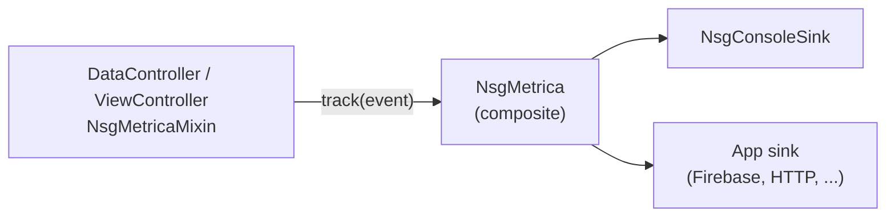

# nsg_data v2

## Обзор

V2 — слоистая архитектура поверх legacy `nsg_data`. Всё приложение строится через **composition root** (`AppComposition`): зависимости объявляются явно через конструкторы или DI, у каждой зависимости есть собственный жизненный цикл (`Lifecycle`). Система состоит из трёх слоёв: **data** (загрузка и сохранение), **logic** (контроллеры состояния), **view** (страницы, формы, навигация). Контракты описываются в `abstract/` и не зависят от конкретного UI-фреймворка — это позволяет подключать `bloc`, `riverpod`, `mobx` как тонкие адаптеры без дублирования бизнес-логики.

Полная диаграмма архитектуры: [ARCHITECTURE_MODEL.md](ARCHITECTURE_MODEL.md).

---

## Структура директорий

```
lib/v2/
├── v2.dart                        # главный экспорт пакета
├── ARCHITECTURE_MODEL.md
├── README.md
├── abstract/                      # контракты (интерфейсы)
│   ├── abstract.dart
│   ├── controller.dart            # Controller, QueryController, CommandController
│   ├── data_source.dart           # DataSource
│   ├── snapshot.dart              # Snapshot
│   ├── store.dart                 # Store
│   ├── lifecycle.dart             # Lifecycle
│   ├── di.dart                    # DI<D>
│   ├── metrica.dart               # MetricaEvent, MetricaSink, Metrica
│   ├── app_composition.dart       # AppComposition
│   ├── app_navigator.dart         # AppNavigator
│   └── data_item.dart             # DataItem
├── base/                          # базовые реализации инфраструктуры
│   ├── base.dart
│   ├── nsg_di.dart                # NsgDI — DI с qualifier
│   ├── nsg_data_source.dart       # NsgDataSource — DataSource + retry hooks
│   ├── nsg_lifecycle.dart         # NsgLifecycle — маркер для DI
│   ├── nsg_navigator.dart         # NsgNavigatorV2 — обёртка над NsgNavigator
│   └── nsg_app_composition.dart   # NsgAppComposition
├── controller/                    # контроллеры состояния
│   ├── controller.dart
│   ├── nsg_controller_store.dart  # NsgControllerStore<T> — stream broadcast
│   ├── nsg_controller_snapshot.dart  # NsgControllerSnapshot<T>
│   ├── nsg_controller_status.dart    # NsgControllerStatus enum
│   ├── nsg_controller_filter.dart    # NsgControllerFilterV2
│   ├── nsg_metrica_mixin.dart        # NsgMetricaMixin — хуки аналитики
│   ├── data/
│   │   ├── nsg_data_controller.dart  # DataController, NsgDataControllerV2<T>
│   │   ├── nsg_data_query_controller.dart
│   │   └── nsg_data_command_controller.dart
│   └── view/
│       ├── nsg_view_controller.dart  # ViewController, NsgViewControllerV2<T>
│       ├── nsg_view_query_controller.dart
│       └── nsg_view_command_controller.dart
├── data_source/                   # транспорт и хранение
│   ├── data_source.dart
│   ├── nsg_remote.dart            # NsgRemoteDataSource — HTTP + retry
│   ├── nsg_local.dart             # NsgLocalDataSource — локальная БД + retry
│   └── nsg_cached_request_params.dart  # нормализация ключа кеша
├── metrica/                       # аналитика и логирование
│   ├── metrica.dart               # barrel
│   ├── nsg_metrica.dart           # NsgMetrica — composite, fan-out в sinks
│   ├── nsg_metrica_events.dart    # встроенные типы событий
│   └── nsg_console_sink.dart      # NsgConsoleSink — debug sink
├── bloc/
│   └── nsg_data_bloc.dart         # NsgDataBloc<T>
└── riverpod/
    └── nsg_data_provider.dart     # NsgDataStateNotifier<T>, nsgDataProvider
```

---

## Слои

### `abstract/` — контракты

Описывают *что* делает каждая часть системы, без деталей реализации и без зависимостей от UI-фреймворков.

| Тип | Роль |
|---|---|
| `Controller` | базовый контракт: `snapshot`, `loadReference`, `requestParams`, `status` |
| `QueryController<T>` | `refresh(...)` и `load(...)` |
| `CommandController<T>` | `create()`, `save(...)`, `delete(...)` |
| `DataSource` | `fetchItems`, `fetchById`, `upsert`, `upsertMany`, `deleteMany`, `deleteById`, `selectCount` |
| `Snapshot` | иммутабельная единица состояния с `copyWith()` |
| `Store` | владелец текущего `Snapshot` + `update(next)` |
| `Lifecycle` | `init()` / `dispose()` |
| `DI<D>` | `bind<T>`, `unbind<T>`, `find<T>`, `findOrNull<T>`, `reset()` |
| `MetricaEvent` | базовое событие: `name`, `timestamp`, `params` |
| `MetricaSink` | приёмник событий (`track`); `Lifecycle` |
| `Metrica` | сервис: `track`, `addSink`, `removeSink`; `Lifecycle` |
| `AppComposition` | корень зависимостей: `di` + `navigator` |
| `AppNavigator` | `push`, `pop`, `go`, `clear` |
| `DataItem` | модель: `id`, `toJson`, `fromJson`, `copyWith` |

### `base/` — инфраструктура

Конкретные реализации, которые можно подключить напрямую или расширить.

| Тип | Ключевые детали |
|---|---|
| `NsgDI` | хранит `Map<(Type, qualifier?), Lifecycle>`; `bind` вызывает `init()`, `unbind` вызывает `dispose()` |
| `NsgDataSource` | добавляет к `DataSource` поля `retryOptions`, `retryIf`, `onRetry`; каждый метод принимает per-call override |
| `NsgLifecycle` | маркер-интерфейс для объектов, управляемых `NsgDI` |
| `NsgNavigatorV2` | делегирует в глобальный `NsgNavigator`; `clear()` переходит к `initialRoute ?? "/"` |
| `NsgAppComposition` | сужает `AppComposition` до `NsgDI` + `NsgNavigatorV2` |

### `controller/` — слой логики

#### `NsgControllerStore<T>` и `NsgControllerSnapshot<T>`

`NsgControllerStore<T>` — единственный источник истины. Любое изменение состояния контроллера обязано заканчиваться вызовом `store.update(snapshot.copyWith(...))`.

```dart
// Поля NsgControllerSnapshot<T>
Iterable<T> items
int totalCount
NsgControllerStatus status        // idle | loading | success | error
Exception? error
NsgDataRequestParams requestParams
Iterable<String> loadReference
List<NsgValidationResult>? validateResults
```

`NsgControllerStoreMixin` предоставляет:
- `Stream<S> get stream` — broadcast stream снапшотов
- `void update(S next)` — публикует новый снапшот

#### `NsgDataControllerV2<T>` — data layer

Объединяет три mixin: `DataController`, `NsgDataQueryControllerV2`, `NsgDataCommandControllerV2`.

```dart
NsgDataControllerV2({
  required NsgDataSource dataSource,
  NsgControllerStore<T>? store,      // создаётся автоматически если не передан
  bool autoLoadOnInit = false,       // вызвать refresh() при init()
  bool useDataCache = false,         // кешировать результат load() in-memory
  bool disposeStore = true,          // dispose store при dispose контроллера
  Metrica? metrica,                  // null — трекинг отключён
})
```

Ключевые методы:

| Метод | Поведение |
|---|---|
| `refresh({items, loadReference, requestParams})` | `status → loading`, вызывает `load()` + `selectCount()`, обновляет снапшот; игнорирует `NsgV2ExceptionDataObsolete` |
| `load({requestParams, loadReference})` | читает из `dataSource`; **stale guard**: если пока шёл запрос появился более новый, бросает `NsgV2ExceptionDataObsolete` |
| `replaceRequestParams(params, {loadReference})` | заменяет `requestParams` в снапшоте без refresh |
| `create()` | POST на сервер или локальный прототип через `newRecordFill()` |
| `save({items, loadReference})` | валидация → `upsertMany` → merge saved ids в снапшот |
| `delete({items})` | `deleteMany` → удаляет из снапшота |
| `retryIf(e)` | не повторяет при HTTP 400/401/403/500 и при `retryIf` из `dataSource` |

При переданном `metrica` автоматически отправляются события: `init`, `dispose`, `load`, `save`, `delete`, `error`, `retry` (см. [Метрика](#метрика-nsgmetrica)).

#### `NsgViewControllerV2<T>` — view layer

Добавляет page-scoped состояние: выбранный элемент и его резервная копия для формы редактирования.

```dart
NsgViewControllerV2({
  required NsgDataControllerV2<T> dataController,
  NsgControllerStore<T>? selectedStore,  // для selectedItem
  NsgControllerStore<T>? backupStore,    // для backupItem (клон до редактирования)
  bool refreshOnInit = false,            // вызвать dataController.refresh() при init()
  NsgControllerRegime regime = NsgControllerRegime.view,
  Metrica? metrica,                      // по умолчанию — dataController.metrica
})
```

Ключевые методы и свойства:

| Элемент | Описание |
|---|---|
| `selectedItem` / `selectedItems` | текущий выбранный элемент (первый в `selectedStore`) |
| `backupItem` | копия до редактирования для отслеживания `isModified` |
| `isModified` | `!selectedItem.isEqual(backupItem)` |
| `select(item, {saveAsBackup})` | установить `selectedItem`; если `saveAsBackup` — клонировать в `backupItem` |
| `saveBackup(item)` | установить оба: `selectedItem` и `backupItem = item.clone()` |
| `restoreFromBackup()` | `selectedItem = backupItem.clone()` |
| `createAndSelect({saveAsBackup})` | `create()` + `select` нового элемента |
| `saveSelected({loadReference})` | merge → save → обновить `selectedItem` и `backupItem` |
| `deleteSelected()` | удалить `selectedItem`, очистить оба store |
| `observeStatus({listenables, builder})` | `StreamBuilder` по умолчанию объединяет `itemsUpdates`, `selectedItemsUpdates`, `backupItemsUpdates` |

Дополнительно при `metrica != null`: `init`, `dispose`, `select` (user_action), `createAndSelect` (user_action). Операции `refresh` / `save` / `delete` идут через `dataController` и дублируются там же.

### `data_source/` — транспорт

| Тип | Транспорт |
|---|---|
| `NsgRemoteDataSource` | HTTP через `NsgDataRequest` / `NsgDataPost` / `NsgDataDelete` с `retry.retry` |
| `NsgLocalDataSource` | `NsgLocalDb` с `retry.retry` |
| `NsgCachedRequestParams` | нормализует `NsgDataRequestParams` в строку-ключ (для кеша запросов) |

### `metrica/` — аналитика (NsgMetrica)

Сервис сбора метрик, логирования и действий пользователя. Не привязан к конкретному backend — приложение регистрирует один или несколько **sink**-ов.



| Тип | Роль |
|---|---|
| `MetricaEvent` | базовый класс события; app может наследовать свои типы |
| `MetricaSink` | приёмник: `track(event)` async |
| `NsgMetrica` | composite: рассылает событие во все sinks; `track()` синхронный (fire-and-forget) |
| `NsgConsoleSink` | вывод в `debugPrint`, только в `kDebugMode` по умолчанию |
| `NsgMetricaMixin` | хелперы на контроллере; `metrica == null` — тихий no-op |

#### Регистрация в composition root

```dart
await composition.di.bind<NsgMetrica>(
  NsgMetrica(sinks: [
    NsgConsoleSink(),
    MyFirebaseMetricaSink(), // реализация в app
  ]),
);
```

#### Подключение к контроллеру

```dart
final metrica = composition.di.findOrNull<Metrica>();

final dataController = NsgDataControllerV2<MyItem>(
  dataSource: NsgRemoteDataSource(),
  metrica: metrica,
);

final viewController = NsgViewControllerV2<MyItem>(
  dataController: dataController,
  // metrica можно не передавать — возьмётся из dataController
);
```

Важно: для view-слоя событие `init`/`dispose` приходит только если вызван `viewController.init()` / `dispose()`. Data-слой — отдельно при `dataController.init()` / `dispose()`.

#### Встроенные события

| Класс | Имя (`name`) | Когда | Авто / ручной |
|---|---|---|---|
| `NsgMetricaInitEvent` | `nsg.controller.init` | `init()` контроллера | авто |
| `NsgMetricaDisposeEvent` | `nsg.controller.dispose` | `dispose()` контроллера | авто |
| `NsgMetricaLoadEvent` | `nsg.controller.load` | успешный `refresh()` | авто |
| `NsgMetricaSaveEvent` | `nsg.controller.save` | успешный `save()` | авто |
| `NsgMetricaDeleteEvent` | `nsg.controller.delete` | успешный `delete()` | авто |
| `NsgMetricaErrorEvent` | `nsg.controller.error` | исключение в refresh/save/delete | авто |
| `NsgMetricaRetryEvent` | `nsg.controller.retry` | `onRetry` | авто |
| `NsgMetricaNavigationEvent` | `nsg.navigation` | переход по маршруту | ручной |
| `NsgMetricaUserActionEvent` | `nsg.user_action` | действие пользователя | ручной / частично авто (`select`) |
| `NsgMetricaPerformanceEvent` | `nsg.performance` | замер времени | ручной |

Параметр `controller_key` во всех controller-событиях — `metricaControllerKey` (по умолчанию `runtimeType.toString()`, можно переопределить в mixin).

#### Ручная отправка

```dart
// через контроллер
viewController.trackEvent(
  NsgMetricaUserActionEvent(action: 'filter_applied', target: 'players'),
);

// напрямую через сервис
metrica?.track(NsgMetricaNavigationEvent(route: '/players', fromRoute: '/home'));
```

#### Свой sink в приложении

```dart
class MyFirebaseMetricaSink implements MetricaSink {
  @override
  Future<void> init() async { /* ... */ }

  @override
  Future<void> dispose() async { /* ... */ }

  @override
  Future<void> track(MetricaEvent event) async {
    await FirebaseAnalytics.instance.logEvent(
      name: event.name,
      parameters: event.params.map((k, v) => MapEntry(k, v?.toString() ?? '')),
    );
  }
}
```

Ошибки внутри sink не пробрасываются в контроллер — `NsgMetrica` логирует их и продолжает работу.

**Вне scope пакета (планируется отдельно):** offline-очередь событий, автохук навигации в `NsgNavigatorV2`.

### `bloc/` и `riverpod/` — адаптеры

Оба адаптера получают уже готовый `NsgViewControllerV2`, подписываются на его `itemsUpdates` и экспонируют `NsgControllerSnapshot` как состояние фреймворка.

**Важно:** адаптеры зеркалируют только **основной список** (`itemsUpdates`). Состояние `selectedStore` / `backupStore` в адаптер не попадает — для подписки на него используйте `controller.selectedItemsUpdates` или `observeStatus(...)`. Адаптеры **не** дублируют метрику — трекинг остаётся в контроллерах / app-коде.

#### `NsgDataBloc<T>`

```dart
NsgDataBloc({
  required NsgViewControllerV2<T> controller,
  bool disposeControllerOnClose = true,
})
```

| Событие | Действие |
|---|---|
| `NsgDataRefreshEvent` | `replaceRequestParams` (опционально) + `controller.refresh()` |
| `NsgDataSelectEvent` | `controller.select(item)` |
| `NsgDataCreateEvent` | `controller.createAndSelect()` или `controller.create()` |
| `NsgDataSaveSelectedEvent` | `controller.saveSelected()` |
| `NsgDataDeleteSelectedEvent` | `controller.deleteSelected()` |

#### `NsgDataStateNotifier<T>` (Riverpod 1.x)

```dart
// Создание провайдера
final myProvider = nsgDataProvider<MyItem>(
  controller: NsgViewControllerV2(dataController: myDataController),
  disposeControllerOnDispose: true,
);
```

Методы: `init()`, `refresh({params, loadReference})`, `select(item)`, `create({selectCreated, saveAsBackup})`, `saveSelected()`, `deleteSelected()`.

---

## Типичный use-case

```dart
// 0. (опционально) метрика в DI
await appComposition.di.bind<NsgMetrica>(
  NsgMetrica(sinks: [NsgConsoleSink()]),
);
final metrica = appComposition.di.findOrNull<Metrica>();

// 1. Создать data controller
final dataController = NsgDataControllerV2<MyItem>(
  dataSource: NsgRemoteDataSource(),
  autoLoadOnInit: true,
  metrica: metrica,
);

// 2. Обернуть в view controller
final viewController = NsgViewControllerV2<MyItem>(
  dataController: dataController,
  refreshOnInit: false,
);

// 3a. BLoC
final bloc = NsgDataBloc(controller: viewController);
await bloc.init();

// 3b. Riverpod
final provider = nsgDataProvider<MyItem>(controller: viewController);

// 4. UI через observeStatus
viewController.observeStatus(
  builder: (context, snapshot) {
    if (snapshot.status == NsgControllerStatus.loading) {
      return const CircularProgressIndicator();
    }
    return ListView(
      children: snapshot.items.map((item) => Text(item.id)).toList(),
    );
  },
);
```

---

## Архитектурный стандарт

### Обязательно
1. Зависимости передаются явно через конструктор, composition root или `AppComposition`.
2. Каждая сущность имеет одну основную ответственность.
3. Сначала проектируется контракт и ответственность, только потом реализация и связи.
4. Состояние, которое живёт дольше одного метода, должно иметь явного владельца: `store`, `controller` или `composition`.
5. Название сущности должно отражать её архитектурную роль.
6. Если поведение относится к странице, форме, навигации или локальному UI-state, оно должно жить в `ViewController`.
7. Если поведение относится к чтению или изменению данных, оно должно жить в `DataController`, `QueryController`, `CommandController` или `DataSource`.
8. Для реактивного состояния должен существовать один источник истины, а все остальные представления состояния должны быть производными от него.

### Запрещено
1. Использовать `static` и глобальное состояние как основной способ хранения данных приложения.
2. Искать зависимости неявно внутри бизнес-сущности, если их можно передать явно.
3. Смешивать `DataController` и `ViewController` в одну сущность без явной причины.
4. Дублировать бизнес-логику в адаптерах `bloc`, `riverpod` и других UI-framework слоях.
5. Протаскивать детали конкретного framework в `abstract`, если это не часть самого контракта.
6. Делать один большой интерфейс, если его можно разложить на несколько независимых контрактов.
7. Держать несколько независимых источников истины для одного и того же состояния без явной стратегии синхронизации.
8. Добавлять в abstract состояние, методы или зависимости "на будущее", если они не нужны текущей композиции.

### Допустимо только как исключение
1. `static` допустим только для констант, pure helper-методов или инфраструктуры без бизнес-состояния.
2. Объединение нескольких ролей в одной реализации допустимо только если abstract-границы при этом не размываются.
3. Framework-specific код допустим только в адаптерах или на внешнем слое реализации.
4. Временное упрощение реализации допустимо только если оно не ломает контракт и не закрывает путь к дальнейшей декомпозиции.

### Стандарт для `abstract`

**Обязательно:**
1. `abstract interface` описывает только контракт.
2. Abstract должен быть минимальным, но достаточным для композиции.
3. Abstract должен позволять исключать части системы из композиции без переписывания всей архитектуры.
4. Если сущность естественно делится на `Query`, `Command`, `Data`, `View`, это разделение должно быть видно уже в контрактах.
5. В abstract описываются только внешне значимые состояния и операции.

**Запрещено:**
1. Хранить в abstract детали конкретной реализации.
2. Зашивать в abstract конкретный способ связи: `stream`, `event`, `bloc`, `riverpod`, `getx` и т.д., если это не часть бизнес-контракта.
3. Привязывать abstract к конкретному DI, навигации, способу хранения, способу сериализации или UI-framework.
4. Использовать abstract как место для накопления удобных, но лишних API.

**Проверочный вопрос:** если реализацию можно заменить на другую без изменения контракта, значит abstract спроектирован правильно.

### Стандарт для реализации

**Обязательно:**
1. Реализация должна сохранять границы ответственности, заданные abstract-контрактами.
2. Сначала делается минимальная рабочая реализация, потом она расширяется через `mixin class`, декораторы или дополнительные stores.
3. Переиспользуемая логика выносится в `mixin class` или отдельную сущность, а не копируется вручную.
4. Адаптеры под `bloc`, `riverpod` и другие фреймворки должны быть тонкими.
5. Если состояние можно безопасно вынести в отдельный store, его нужно выносить из controller.

**Запрещено:**
1. Размывать контракт convenience-логикой, которая относится к другому слою.
2. Копировать одну и ту же реализацию в нескольких местах вместо явного переиспользования.
3. Делать `ViewController` владельцем data-layer логики.
4. Делать `DataController` владельцем page-local UI-state.

**Проверочный вопрос:** если удалить конкретный UI-framework или заменить источник данных, бизнес-логика должна остаться работоспособной с минимальными изменениями внешних адаптеров.

---

## Известные ограничения и планируемые улучшения

### selectedItems не синхронизируется с обновлениями списка

`selectedItem` хранится в отдельном `selectedStore` и **не обновляется автоматически** при вызове `DataController.refresh()`. Если данные изменились на сервере, `selectedItem` останется устаревшим экземпляром до явного вызова `select(...)`.

Планируемое решение:
1. Хранить в store не только объект, но и стабильный `id`.
2. После каждого `refresh()` прогонять reconcile: заменять выбранный элемент на актуальный экземпляр по `id`.
3. Добавить policy для отсутствующих элементов: `keepStale`, `dropMissing`, `reloadMissing`.
4. Держать reconcile в `ViewController`, чтобы `DataController` не знал про UI-selection.

### FilterStorage не реализован

Сохранение фильтра лучше делать отдельной зависимостью, а не внутри `DataController`.

Планируемое решение:
1. Добавить `FilterStorage` interface с методами `load(controllerKey)` и `save(controllerKey, NsgDataRequestParams)`.
2. В `ViewController` или root composition задавать стабильный `controllerKey`.
3. На `onPageOpen()` читать сохранённый фильтр и прокидывать через `replaceRequestParams(...)`.
4. Сохранять только сериализуемый DTO, без живых ссылок на контроллеры и UI-state.
5. При необходимости нескольких профилей — расширить ключ до `controllerKey + profileId`.
